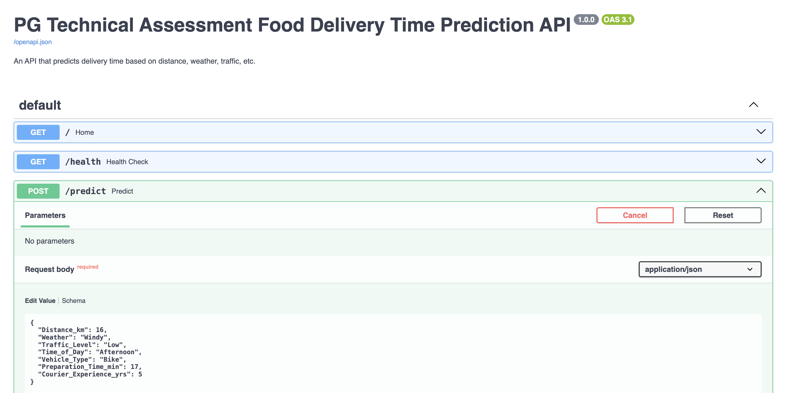
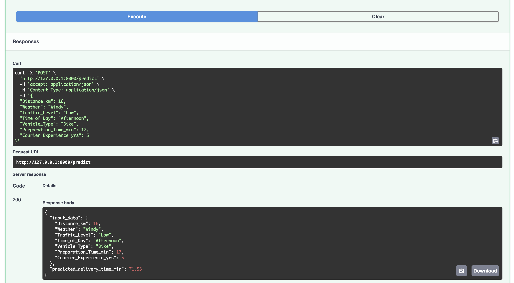

# PG Technical Assessment Food Delivery Time Prediction API

This is a **FastAPI prototype** for predicting food delivery times based on distance, weather, traffic, etc.  
It has endpoints so that user can generate sample test data and make a simulated prediction like 'real-time'

---

## Structure

api_prototype/app.py

api_prototype/README.md

---

## Prerequisites

- Project was created with Python 3.12  
- Install packages:
 > `pip install -r requirements.txt`


# How to Run

Open a terminal (or use PyCharm) and navigate to the project folder:

Root/api_prototype/app.py

## Update the model path in config.toml:
[model.save]
    path = "model_pipeline/data/"

## Run the API using Uvicorn:
>uvicorn app:app --reload

You should see output like below in the terminal:

INFO:     Uvicorn running on http://127.0.0.1:8000 (Press CTRL+C to quit)
INFO:     Started reloader process [17975] using StatReload
INFO:     Started server process [17988]
INFO:     Waiting for application startup.
INFO:     Application startup complete.

## API Endpoints
1. Home

GET /

Returns a simple welcome message.

2. Health Check

GET /health

Returns status of the API and whether the model is loaded.

3. Sample Data

GET /sample-data?n=5

Generates n fake sample records for testing predictions.

Example: /sample-data?n=3 returns 3 sample delivery feature records.

4. Predict

POST /predict

Sends a single delivery feature record and receives a predicted delivery time.

## Request JSON Example:

```json
{
  "Distance_km": 16,
  "Weather": "Windy",
  "Traffic_Level": "Low",
  "Time_of_Day": "Afternoon",
  "Vehicle_Type": "Bike",
  "Preparation_Time_min": 17,
  "Courier_Experience_yrs": 5
}
```

## Response Example:

```json
{
  "input_data": {
    "Distance_km": 16,
    "Weather": "Windy",
    "Traffic_Level": "Low",
    "Time_of_Day": "Afternoon",
    "Vehicle_Type": "Bike",
    "Preparation_Time_min": 17,
    "Courier_Experience_yrs": 5
  },
  "predicted_delivery_time_min": 71.53
}
```

## Testing the API

Open browser and go to Swagger UI:
http://127.0.0.1:8000/docs

Use the /sample-data endpoint to generate test inputs.

Copy a sample record into /predict and execute to see the prediction.

## Notes

* Make sure your model file is compatible with the input features defined in the API.

* FastAPI automatically validates inputs using Pydantic. Incorrect data types will return a 400 error.

## Using PyCharm

1. Open the project folder in PyCharm.

2. Set the Python interpreter where dependencies are installed.

3. Create a Run Configuration:
Script path: app.py

Parameters: uvicorn app:app --reload

Working directory: project folder

#### ... And Click Run

## UI



