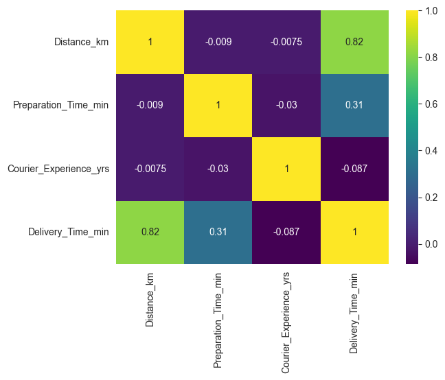
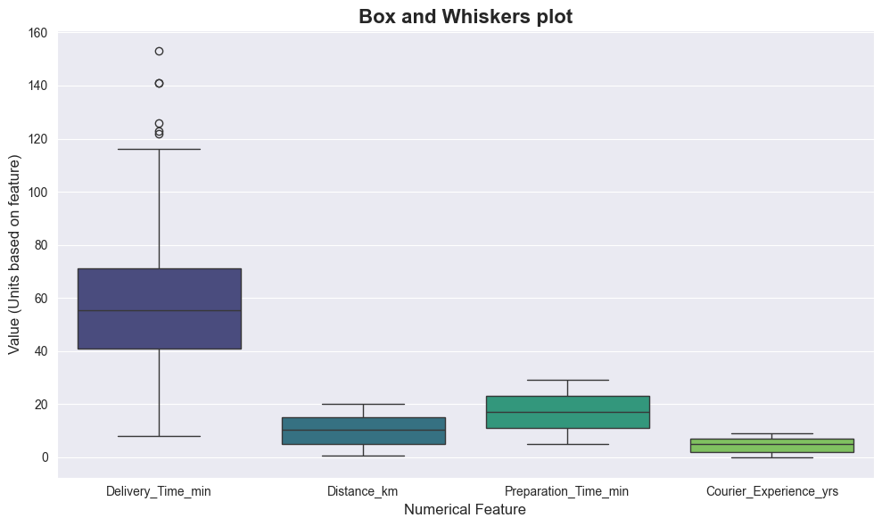

# Exploratory Data Analysis: data understanding phase

---

> **Note:** Notebook with additional analysis and charts can be found in model_pipeline/notebooks/[EDA.ipynb](model_pipeline/notebooks/EDA.ipynb)

> **Important:** Some charts in this document were created with AI assistant tools speeding up code templates for seaborn, matplotlib.

Objectives:
* Identify missing values and determine strategy to handle the cases
* Understand the correlation matrix evaluating target against independent variables, also check if there is an indication of multicollinearity among other independent variables
* Understand distribution of target variable and independent variables (numerical) with histograms
* Validate for potential outliers and determine strategy to handle the cases, if required
* Evaluate the categorical values by doing frequency distribution and determine strategy to tackle under-represented or predominant values if required
* Drive conclusions for data preparation phase (data preprocessing)

---

# General information about the dataset
1. It contains 1000 records.
2. Columns are 9: 4 are categorical and 4 numerical, 1 is an ID.
3. Four columns with missing values: Weather, Traffic Level, Time_of_Day, Courier_Experience_yrs. 30 values missing for each.
4. No duplicates were found.

# Missing values
* Data has 117 records with missing values, representing 12% of total records.
* Will explore more the data to determine the strategy for missing values

# Correlation Matrix

* Spearman selected as test (better suited for real world cases with non-normal distributed data).
* When checking against target variable, the Distance_km is having a strong positive correlation: expected behavior.
* Other features which are having a positive correlation makes sense beforehand, like preparation time. It confirms that the expected features are present when leading to high delivery times.
* Courier experience appears as negative, but not strong.
* Correlation values between independent variables are low therefore not evident multicollinearity, which is positive if progressing with this case as a regression problem.

# Distribution of numerical columns

* Exploring the worst case scenario, delivery time MAX value is 2.7 times greater than the average; by taking the 75th percentile it is 2.15 times greater therefore an unlikely case.
* Likewise, the MIN value is 7 times less than the average, also very unlikely.
* Delivery time mean and median are very close, 56 and 55 respectively, while the standard deviation is 22, therefore very spread.
* For Delivery time, IQR lies between 41 and 71 minutes for typical cases.
* By doing the same exercise over preparation time, IQR lies between 11 and 23 minutes, way closer to the best and worst cases having 5 and 29 minutes.
* Repeating the exercise for distance, the IQR lies between 5.11 Km and 15.02 Km as potential typical cases, while not so close to the extreme values considering that MIN was 0.59 Km and MAX 20 Km.
* Courier experience has an average of 4.6 years and median is at 5 years, with 75% of total having 2 years or more of experience (high retention of delivery partners)

# Potential anomalies

* Evaluating the target with the box plot, there are 6 cases over the upper whisker. These cases are associated with large distances (15 Km or more), sometimes combined with high preparation time and weather being rainy, regardless of a low traffic and being delivered by an experienced courier.
* As commented, these cases are very unlikely, but can't be ruled out as there are no additional sources or means to validate that they are an anomaly (e.g. wrong input).
* Consequently, these cases are underrepresented in the data, but better to keep them as they are part of the nature of the business operations, therefore the model can be evaluated considering the probability of facing such cases.

# Frequency distribution for categorical values

* Regarding Weather: clear and rainy are the predominant observations with 70% of total, of which clear accounts for 49%, while Foggy, Snowy and Windy are around 10% each.
* Traffic level: Medium and Low are the predominant observations, and are also very close around 40% both, while High is having 20%.
* Time of Day: Most of the orders are happening during the Morning, Afternoon and Evening with 91% in total, while only 9% occur during the nigh.
* Vehicle type: Bike appears as the most common type with 50%, followed by Scooter with 30% and then Car represents 20%.

# Final Remarks and conclusions for data preparation and modeling

* After checking the categorical columns more in detail, one option for the missing values is that a flag is created when value is unknown, therefore allowing it as an additional category, that, while underrepresented, can replicate what can occur while in production, where same issue might rise. Also, it is preferred to avoid filling missing based on current proportion of values by category, as this might introduce bias to the training data.
* About the anomalies, as commented, these cases are very unlikely, but can't be ruled out as there are no additional sources or means to validate that they are an anomaly (e.g. wrong input).
* Consequently, these cases are underrepresented in the data, but better to keep them as they are part of the nature of the business operations, therefore the model can be evaluated considering the probability of facing such cases.
* About courier experience years missing values, given the low correlation with the target and very centered data, with a median of 5 years and 75% of total courier over 2 years of courier partners, this value might work to fill the missing.
* Regarding new features to experiment with, as some algorithms for benchmarking could require one-hot encoding, this task will be performed. Also, additional features are going to be engineered by combining the current ones.
* Strategy for modeling is to start testing with baseline features and baseline algorithms and then add a new feature and compare performance, for multiple combinations of features, also test algorithms (from simpler to more complex) and compare performance therefore after each experiment, it can be determined if the path taken is correct and continue optimizing it.
* ### **Finally, about modeling, the following finding could lead to a strategy of experimenting with models by weather: Weather Clear has 4% less average delivery time compared to Windy, 12% to 13% less compared to Foggy and Rainy which are both very close in average delivery time and 26% less average delivery time compared to Snowy.**

