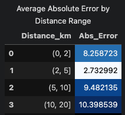
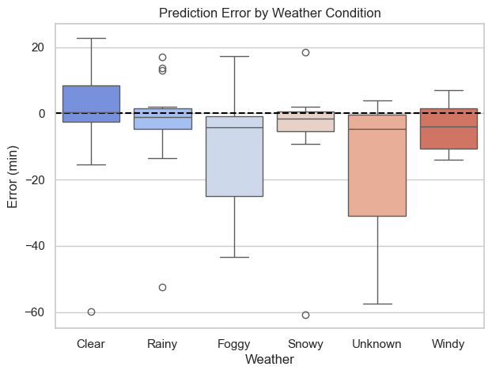

# Error Insights

---

1. Overall, errors for CatBoost algorithm are around 15 min or less. 
2. The real challenge comes when predicting accurately for long distance trips, which pose a challenge in the operations and performance drops as distance increase.
3. Remembering that distance is the feature that influences the most in the predicting power of the model, it becomes evident that mastering the relationships of distance together with the other variables will open the opportunity to enhancements in the performance.
4. Comparing the average error for orders above 5 Km and below 2 Km, which are 4X to 5X greater than the performance in a distance of 2-5 Km, specially in foggy, rainy and snowy days, which adds more complexity to the problem.
5. It is clear that orders above 50 min are very challenging to predict, compared to the overall, which suggests that, as logic as it seems, a closer look into the worst offenders in terms of distance will bring more information, moreover if there is a possibility to enrich the current dataset with other references, as it was mentioned in the EDA.

