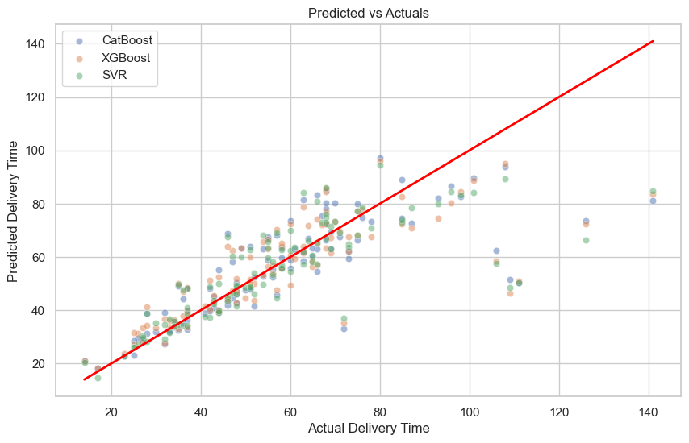

# Explainability

---

* ### Understand results and if algorithms are fitting the problem, where they struggle, residuals.
* ### Results are depicting that the challenge has a high level of complexity, also it seems to require more sophisticated approaches

### Top 3 algorithms R²:

| Model    | R²   |
|----------|------|
| CatBoost | 0.60 |
| SVR      | 0.59 |
| XGBoost  | 0.58 |

### This aligns with CatBoost also being the best performer for the task when looking at RMSE.

## SHAP

### Distance Km having 3x more importance than the 2nd feature in importance order, although not surprising as it aligns with the correlation matrix results, invite you to think if more features can be extracted from distance, e.g. thresholds or buckets of N Km e.g. less than 7.5 Km, Between 7.5 Km and 15 Km, and higher than 15 Km.

## Actual values compared to predicted values by algorithm:

### No algorithm was able to get close to actuals when predicting high average delivery time orders. 

## Actual values compared to predicted for Top 3 Algorithms (CatBoost, SVR, XGBoost):

### It seems that around the 70th minute for an average delivery time, predictions starts to deviate from the center, meaning difficulty to predict the time of similar orders that go above this time.

## Error distribution per algorithm

### It doesn't seem that algorithms are either predicting above or below the target, it seems balanced. CatBoost cases closer to 0 are more than for the other algorithms.

## Error by distance and algorithm

### It seems a real challenge to predict orders above 7 Km, the 3 algorithms start to drift and are unfit for most of the cases. 

